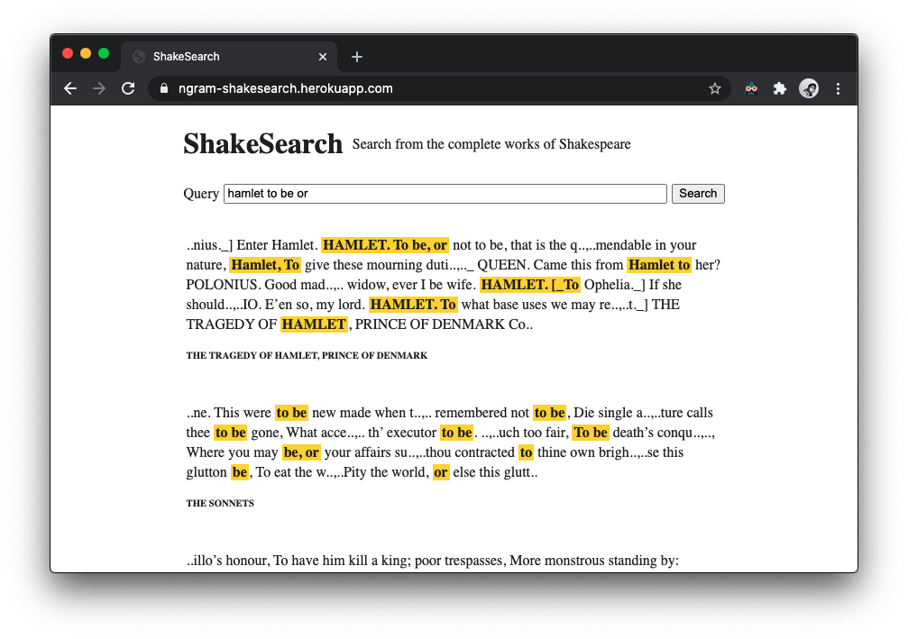

This is a customized version of ShakeSearch by @piglovesyou.

https://ngram-shakesearch.herokuapp.com

## Features

*   NGram search.
*   Scoring. Show results that most likely users look for on top.
*   Per-work titles search results.

## Time took to impl

A week, 1-5 hours a day.

## Tough part

Golang. First time to write. I kind of like it, except pointers, no overload, no array functions such as map/filter/reduce and less smart type inference than TypeScript :)

## How do you prioritize features?

*   I believe users look for a work of Shakespeare, instead of text fragments in completeworks.txt. So, I prioritized spliting completeworks.txt into works first.
*   It is likely that users query keywords of the works, instead of random characters. So NGram index would be helpful and efficient.
*   Users want to be sure that the results are what they're looking for. So highlighting the tokens is not optional.

## What features/tasks do you omit?

*   Incremental search.
*   Query suggestion/autocomplete on typing.
*   `history.pushState()` on search so users can share their URL.
*   Show ACT numbers in addition to the work titles.
*   "these words were excluded" message. Currently, it's OR search where some of query words can be ignored by the search results. 
*   More tests and refactoring.

----

# ShakeSearch

Welcome to the Pulley Shakesearch Take-home Challenge! In this repository,
you'll find a simple web app that allows a user to search for a text string in
the complete works of Shakespeare.

You can see a live version of the app at
https://pulley-shakesearch.herokuapp.com/. Try searching for "Hamlet" to display
a set of results.

In it's current state, however, the app is just a rough prototype. The search is
case sensitive, the results are difficult to read, and the search is limited to
exact matches.

## Your Mission

Improve the search backend. Think about the problem from the **user's perspective**
and prioritize your changes according to what you think is most useful.

## Evaluation

We will be primarily evaluating based on how well the search works for users. A search result with a lot of features (i.e. multi-words and mis-spellings handled), but with results that are hard to read would not be a strong submission.

## Submission

1.  Fork this repository and send us a link to your fork after pushing your changes.
2.  Heroku hosting - The project includes a Heroku Procfile and, in its
    current state, can be deployed easily on Heroku's free tier.
3.  In your submission, share with us what changes you made and how you would prioritize changes if you had more time.
